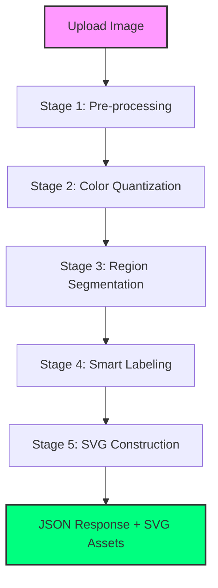

# 🎨 ColorArt Backend
> **High-Performance Image-to-SVG Pipeline for Color-by-Number Applications**

[](https://fastapi.tiangolo.com/)
[](https://www.python.org/)
[](https://www.docker.com/)
[](https://render.com)

---

## ✨ Overview

**ColorArt Backend** is a specialized image processing engine designed to power "Color-by-Number" style applications. It transforms standard raster images (JPEG, PNG, WebP) into highly structured, vectorized SVG data. 

Unlike heavy AI models, this is a **pure algorithmic pipeline** optimized for speed, reliability, and low resource usage.

### 🚀 Key Features
- **Intelligent Quantization**: Uses MiniBatchKMeans for lightning-fast color reduction.
- **Precision Segmentation**: Advanced region extraction with automated micro-region merging to eliminate noise.
- **Smart Labeling**: Numbers are placed at the **Pole of Inaccessibility** (the geometric center of the largest inscribed circle), ensuring perfect placement every time.
- **Vectorized Fidelity**: Multi-stage smoothing (Chaikin's corner-cutting + Catmull-Rom splines) for silky-smooth SVG paths.
- **Interactive Metadata**: Generates a complete **Adjacency Graph** (neighbor list) and precise region coordinates for interactive tap-to-color mobile and web apps.

---

## 🛠️ The Pipeline



1.  **Preprocessing**: Automatic resizing (preserving aspect ratio) and illustration-type detection.
2.  **Quantization**: Reduction to a specified palette (4–128 colors).
3.  **Connected Components**: Extraction of unique regions and outer contours.
4.  **Optimization**: Merging of tiny "speckle" regions into dominant neighbors.
5.  **Placement**: Finding the point inside each region furthest from its boundary for labels.
6.  **Smoothing**: Converting jagged polylines into cubic Bézier SVG paths.

---

## 🚦 API Reference

### `POST /api/process`
Process an image through the pipeline.

**Parameters (Form Data):**

| Field | Type | Default | Description |
| :--- | :--- | :--- | :--- |
| `image` | `File` | Required | JPEG, PNG, WebP, BMP (max 20MB) |
| `num_colors` | `int` | `32` | Number of colors (4–128) |
| `max_dimension`| `int` | `1024` | Scale longest side to this (256–2048) |
| `target_regions`| `int` | `None` | Target count; merges smallest regions to reach this. |

**Example Response:**
```json
{
  "width": 1024,
  "height": 768,
  "svg_outline": "<svg>...</svg>",
  "svg_colored": "<svg>...</svg>",
  "palette": ["#FF6B9D", "#4A90E2", ...],
  "regions": [...],
  "adjacency": { "1": [2, 5], "2": [1, 3] },
  "timing": { "total": 0.959 }
}
```

### `GET /api/health`
Quick check for service status and versioning.

---

## 💻 Local Development

1.  **Clone & Setup**:
    ```bash
    git clone https://github.com/S0SP/colorart_custum_processing_pipeline.git
    cd colorart_custum_processing_pipeline
    ```

2.  **Install Dependencies**:
    ```bash
    pip install -r requirements.txt
    ```

3.  **Run Server**:
    ```bash
    uvicorn main:app --reload
    ```
    Access the interactive API docs at `http://localhost:8000/docs`.

---

## ☁️ Deployment

### Render (Recommended)
This repo is **Render Blueprint-ready**. 
- Connect your GitHub repo.
- Render will automatically use `render.yaml` to configure your service.
- **Build Command**: `pip install -r requirements.txt`
- **Start Command**: `uvicorn main:app --host 0.0.0.0 --port $PORT`

### Docker
```bash
docker build -t colorart-backend .
docker run -p 8000:8000 colorart-backend
```

---

## 🧬 Tech Stack
- **FastAPI**: Modern, high-performance web framework.
- **OpenCV**: Advanced image processing and computer vision.
- **Scikit-Learn**: Robust MiniBatchKMeans for color quantization.
- **Scipy/Numpy**: Scientific computing for segmentation and EDT.
- **Pillow**: Versatile image format handling.

---

## 📄 License
This project is licensed under the MIT License - see the [LICENSE](LICENSE) file for details.

---
*Created with ❤️ for the Color-by-Number community.*
